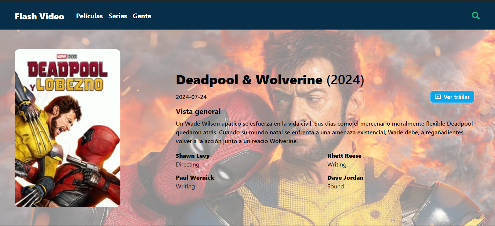
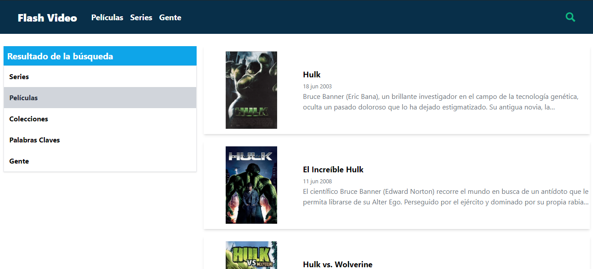

# 🎬 Aplicación de Películas

Aplicación web para buscar y explorar películas, series y actores. Utiliza filtros avanzados para refinar las búsquedas y permite ordenar los resultados por diversos criterios.


## 🚀 Funcionalidades

- **Búsqueda Avanzada**: Encuentra películas, series y actores con opciones de filtrado.
- **Filtros por Categoría**: Filtra resultados por género, fecha de estreno, etc.
- **Ordenamiento Personalizado**: Ordena resultados por título (A-Z, Z-A) o por fecha de estreno (Ascendente, Descendente).
- **Paginación Dinámica**: Carga resultados de forma eficiente mientras navegas por los resultados.
- **Validación de Datos**: Validación robusta de las respuestas de la API usando Zod.

## 🛠 Tecnologías Utilizadas

- **Frontend**: React, TypeScript
- **Gestión de Estado**: Zustand
- **Validación de Datos**: Zod
- **Peticiones a la API**: Axios
- **Manejo de peticiones**: Tanstack Query (React Query)
- **Estilos**: Tailwind CSS, CSS Modules
- **Manejo de Rutas**: React Router

## 📦 Instalación

Asegúrate de tener [Node.js](https://nodejs.org/) instalado en tu sistema.

## Originalmente se usó pnpm.

1. Clona el repositorio:
   ```bash
   git clone https://github.com/tu-usuario/nombre-del-repo.git
2. Ve al directorio del proyecto:
   ```bash
   cd nombre-del-repo
3. Instala las dependencias:
    ```bash
   pnpm install

## 📷 Capturas
### Página de inicio

### Página de película

### Página de categorías

### Página de búsqueda

